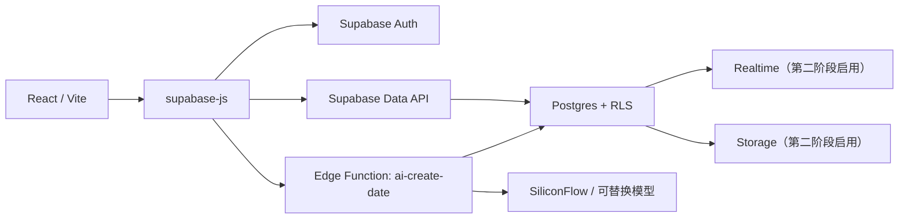

# Dive｜Supabase 30 分钟 MVP 后端最终方案

版本：v1.0  
日期：2026-08-23  
适用项目：当前 Vite + React 的 Dive 流程原型  
目标：在不重写现有 UI 的前提下，用 Supabase 建立一个可真实持久化、可鉴权、可继续接入 AI 的最小后端版本。

> 本文将“30 分钟版本”定义为 MVP 可演示后端。前提是 Supabase 项目已创建，项目 URL、Publishable Key 可用，并且开发者可以进入 SQL Editor 和 Edge Functions。若账号、组织权限或网络尚未准备好，准备时间不计入 30 分钟。

## 1. 最终结论

当前阶段采用 Supabase，不单独搭建 NestJS、Redis、消息队列和对象存储服务。

Supabase 在一个项目内提供：

- PostgreSQL：保存 Profile、Date、收藏、申请和 AI 会话；
- Auth：提供真实用户身份；
- Row Level Security（RLS）：在数据库层限制用户可读写的数据；
- Storage：后续保存 Profile 图片、录音和 AI 封面；
- Realtime：后续监听申请、消息和通知变更；
- Edge Functions：安全调用 SiliconFlow 或其他模型，避免模型密钥进入 React；
- Data API + `supabase-js`：React 直接读取允许访问的数据，减少单独开发 REST 服务的时间。

30 分钟内交付的是这一条纵向闭环：

```text
登录/测试用户
  → 读取活动广场
  → 收藏或 Apply
  → Host 发布 Date
  → 数据刷新后仍然存在
  → AI 创建接口已有稳定契约，可先 Mock、后接真实模型
```

这个版本是“可演示、可继续开发”的后端底座，不是可直接承载真实支付和陌生人线下见面的生产后端。

## 2. 当前项目判断

当前项目是纯前端原型，主要业务数据都位于 `src/App.jsx` 的 React `useState` 中：

- `dates`：活动列表；
- `applications`：申请记录；
- `saved` / `skipped`：收藏与跳过；
- `profiles`：用户资料；
- `chats` / `notifications`：聊天和通知；
- `createDraft`：活动创建草稿。

刷新页面后，上述状态会恢复为种子数据。`src/data/activities.json` 已经可以作为 Supabase 的首批 seed 数据来源。

因此最短接入路径不是重写整个 `App.jsx`，而是先替换四组数据边界：

| 当前前端行为 | 30 分钟版本的数据源 |
| --- | --- |
| 活动广场、活动详情 | `dates` 表查询 |
| Save / 取消 Save | `saved_dates` 表 upsert / delete |
| Apply | `applications` 表 insert |
| 发布 Date | `dates` 表 insert |

Profile、聊天、通知和真实 Lock 流程使用同一架构逐步迁移，但不阻塞第一版后端连通。

## 3. 30 分钟范围

### 3.1 必须完成

1. 建立 `profiles`、`dates`、`saved_dates`、`applications`、`ai_sessions`、`ai_messages` 六张表。
2. 所有公开 schema 表启用 RLS。
3. React 使用 Publishable Key 初始化 Supabase Client；Secret / Service Role Key 不进入前端。
4. 活动可读取、发布；收藏和申请可写入并持久化。
5. 建立一个 `ai-create-date` Edge Function 契约，后续模型调用无需改变前端调用方式。
6. `.env.local` 不提交 Git，提供 `.env.example` 变量名。

### 3.2 明确不在 30 分钟内完成

- 真实 Lock fee、支付 Webhook、退款和资金对账；
- 并发最后一席、超时释放、完整 Invite 状态机；
- 真实录音上传、ASR、TTS 和 AI 图片持久化；
- 完整聊天、群聊、未读数、Push；
- 精确地址字段级加密、内容审核、举报和运营后台；
- 正式推荐算法、日历 OAuth 和 PostGIS 距离排序；
- 原后端方案中的 Outbox、死信队列、完整审计与生产告警。

这些能力继续沿用原《后端逻辑与接入方案》的领域边界，在第二阶段补齐。

## 4. MVP 架构



关键边界：

- 普通 CRUD 由 React 通过 `supabase-js` 访问 Data API，并由 RLS 鉴权；
- 审批、Lock、发布重要修改等复合业务动作，后续使用 Postgres RPC 或 Edge Function；
- 任何模型调用都经过 Edge Function；
- 前端只保存 `VITE_SUPABASE_URL` 和 `VITE_SUPABASE_PUBLISHABLE_KEY`；
- `SILICONFLOW_API_KEY`、Service Role / Secret Key 只保存在 Supabase Secrets。

Supabase 官方说明：暴露 schema 中的表必须启用 RLS；浏览器可使用 Publishable Key，但 Secret / Service Role Key 会绕过 RLS，只能留在服务端。参见 [Row Level Security](https://supabase.com/docs/guides/database/postgres/row-level-security) 和 [Edge Function Secrets](https://supabase.com/docs/guides/functions/secrets)。

## 5. 最小数据模型

### 5.1 字段规范

- 新字段统一使用 `lock_fee_*`，不再新增 `deposit_*`；AI Prompt 里的 `deposit_enabled` / `deposit_amount` 在模型适配层映射为 `lock_fee_enabled` / `lock_fee_amount`。
- 金额使用最小货币单位整数，例如 30 元保存为 `3000`。
- 时间优先保存 `starts_at timestamptz`，原型暂时无法解析的自然语言保留在 `time_text`。
- 数据库主键使用 UUID；原型中的 `vivi`、`ren` 等字符串放在 `legacy_key`，只用于 seed 映射。
- `exact_location` 不进入 30 分钟版本的公开 `dates` 表。仅在前端查询时不选择该列并不能形成安全边界；第二阶段应放入独立私有表，并通过受控 RPC 向已 Lock 用户返回。

### 5.2 表结构

| 表 | MVP 用途 | 关键约束 |
| --- | --- | --- |
| `profiles` | 用户公开资料 | `id = auth.users.id` |
| `dates` | 草稿和已发布活动 | Host 只能修改自己的 Date |
| `saved_dates` | 收藏关系 | `(user_id, date_id)` 唯一 |
| `applications` | Guest Apply | `(date_id, applicant_id)` 唯一 |
| `ai_sessions` | 一次 AI 创建会话及字段状态 | 只允许会话所有者访问 |
| `ai_messages` | 转写、AI 回复和结构化更新 | 从属于 `ai_sessions` |

建议直接在 Supabase SQL Editor 执行以下 MVP migration：

```sql
create extension if not exists pgcrypto;

create table public.profiles (
  id uuid primary key references auth.users(id) on delete cascade,
  legacy_key text unique,
  display_name text not null default 'Dive User',
  city text,
  age int check (age is null or age >= 18),
  intro text,
  interests text[] not null default '{}',
  created_at timestamptz not null default now(),
  updated_at timestamptz not null default now()
);

create table public.dates (
  id uuid primary key default gen_random_uuid(),
  host_id uuid not null references public.profiles(id) on delete cascade,
  legacy_key text unique,
  mode text not null check (mode in ('one', 'small')),
  title text not null,
  activity_content text not null,
  description text not null default '',
  vibe text[] not null default '{}',
  time_text text not null,
  starts_at timestamptz,
  area_text text not null,
  budget_amount int not null default 0 check (budget_amount >= 0),
  currency text not null default 'CNY',
  payment_method text not null default 'AA',
  lock_fee_enabled boolean not null default false,
  lock_fee_amount int not null default 0 check (lock_fee_amount >= 0),
  expectations text not null default '',
  capacity int not null default 2 check (capacity between 2 and 5),
  visibility text not null default 'public' check (visibility in ('public', 'private')),
  status text not null default 'draft' check (status in ('draft', 'recruiting', 'full', 'completed', 'cancelled')),
  ai_proposal_text text,
  ai_tags text[] not null default '{}',
  created_at timestamptz not null default now(),
  updated_at timestamptz not null default now()
);

create table public.saved_dates (
  user_id uuid not null references public.profiles(id) on delete cascade,
  date_id uuid not null references public.dates(id) on delete cascade,
  created_at timestamptz not null default now(),
  primary key (user_id, date_id)
);

create table public.applications (
  id uuid primary key default gen_random_uuid(),
  date_id uuid not null references public.dates(id) on delete cascade,
  applicant_id uuid not null references public.profiles(id) on delete cascade,
  note text not null default '',
  status text not null default 'applied'
    check (status in ('applied', 'approved_pending_lock', 'locked', 'rejected', 'withdrawn')),
  created_at timestamptz not null default now(),
  updated_at timestamptz not null default now(),
  unique (date_id, applicant_id)
);

create table public.ai_sessions (
  id uuid primary key default gen_random_uuid(),
  user_id uuid not null references public.profiles(id) on delete cascade,
  mode text not null check (mode in ('one', 'small')),
  slots jsonb not null default '{}',
  missing_fields text[] not null default '{}',
  last_fields_asked text[] not null default '{}',
  unanswered_counts jsonb not null default '{}',
  phase text not null default 'collecting',
  input_revision int not null default 1,
  created_at timestamptz not null default now(),
  updated_at timestamptz not null default now()
);

create table public.ai_messages (
  id bigint generated always as identity primary key,
  session_id uuid not null references public.ai_sessions(id) on delete cascade,
  role text not null check (role in ('user', 'assistant', 'system')),
  transcript text,
  payload jsonb not null default '{}',
  created_at timestamptz not null default now()
);

create index dates_feed_idx on public.dates (status, visibility, created_at desc);
create index applications_date_idx on public.applications (date_id, status);
create index ai_messages_session_idx on public.ai_messages (session_id, created_at);
```

## 6. RLS 最小策略

RLS 是这个方案的上线底线。创建表后立即执行：

```sql
alter table public.profiles enable row level security;
alter table public.dates enable row level security;
alter table public.saved_dates enable row level security;
alter table public.applications enable row level security;
alter table public.ai_sessions enable row level security;
alter table public.ai_messages enable row level security;

revoke all on public.profiles, public.dates, public.saved_dates,
  public.applications, public.ai_sessions, public.ai_messages
from anon, authenticated;

grant select on public.profiles, public.dates to anon, authenticated;
grant update on public.profiles to authenticated;
grant insert, update on public.dates to authenticated;
grant select, insert, delete on public.saved_dates to authenticated;
grant select, insert on public.applications to authenticated;
grant select, insert, update, delete on public.ai_sessions, public.ai_messages
  to authenticated;
grant usage, select on sequence public.ai_messages_id_seq to authenticated;

create policy "profiles public read"
on public.profiles for select using (true);

create policy "profile owner write"
on public.profiles for all to authenticated
using ((select auth.uid()) = id)
with check ((select auth.uid()) = id);

create policy "published dates public read"
on public.dates for select
using (status in ('recruiting', 'full', 'completed') and visibility = 'public'
       or (select auth.uid()) = host_id);

create policy "host creates dates"
on public.dates for insert to authenticated
with check ((select auth.uid()) = host_id);

create policy "host updates dates"
on public.dates for update to authenticated
using ((select auth.uid()) = host_id)
with check ((select auth.uid()) = host_id);

create policy "owner reads saves"
on public.saved_dates for select to authenticated
using ((select auth.uid()) = user_id);

create policy "owner creates saves"
on public.saved_dates for insert to authenticated
with check ((select auth.uid()) = user_id);

create policy "owner deletes saves"
on public.saved_dates for delete to authenticated
using ((select auth.uid()) = user_id);

create policy "applicant or host reads application"
on public.applications for select to authenticated
using (
  (select auth.uid()) = applicant_id
  or exists (
    select 1 from public.dates d
    where d.id = date_id and d.host_id = (select auth.uid())
  )
);

create policy "guest applies"
on public.applications for insert to authenticated
with check (
  (select auth.uid()) = applicant_id
  and exists (
    select 1 from public.dates d
    where d.id = date_id
      and d.host_id <> (select auth.uid())
      and d.status = 'recruiting'
  )
);

create policy "ai session owner"
on public.ai_sessions for all to authenticated
using ((select auth.uid()) = user_id)
with check ((select auth.uid()) = user_id);

create policy "ai message session owner"
on public.ai_messages for all to authenticated
using (exists (
  select 1 from public.ai_sessions s
  where s.id = session_id and s.user_id = (select auth.uid())
))
with check (exists (
  select 1 from public.ai_sessions s
  where s.id = session_id and s.user_id = (select auth.uid())
));
```

注意：30 分钟版本不允许前端直接更新 `applications.status`。Host 审批应在下一阶段通过 `approve_application(application_id)` RPC 完成，在事务中检查 Host、状态和容量。

## 7. Auth 与测试身份

建议 MVP 使用 Supabase Auth 邮箱登录或 Magic Link。创建用户后，用数据库 trigger 自动创建 Profile：

```sql
create or replace function public.handle_new_user()
returns trigger
language plpgsql
security definer set search_path = ''
as $$
begin
  insert into public.profiles (id, display_name)
  values (new.id, coalesce(new.raw_user_meta_data ->> 'display_name', 'Dive User'));
  return new;
end;
$$;

create trigger on_auth_user_created
after insert on auth.users
for each row execute procedure public.handle_new_user();
```

当前页面顶部的 Vivi / Host 切换只是原型测试器，不能作为真实权限身份。30 分钟联调可以：

- 分别用普通窗口和无痕窗口登录两个测试账号；
- `legacy_key` 分别填 `vivi` 和 `ren`，用于映射原型数据；
- 后续移除 actor switch，所有 `me` 改为 `session.user.id`。

不要在 Vite 环境变量中保存测试账号密码或 Service Role Key。

## 8. React 接入方式

安装客户端：

```bash
npm install @supabase/supabase-js
```

环境变量：

```text
VITE_SUPABASE_URL=https://<project-ref>.supabase.co
VITE_SUPABASE_PUBLISHABLE_KEY=<publishable-key>
```

新增 `src/lib/supabase.js`：

```js
import { createClient } from '@supabase/supabase-js';

export const supabase = createClient(
  import.meta.env.VITE_SUPABASE_URL,
  import.meta.env.VITE_SUPABASE_PUBLISHABLE_KEY,
);
```

建议新增薄数据层，不让 `App.jsx` 到处散落查询：

```text
src/lib/supabase.js
src/services/auth.js
src/services/dates.js
src/services/applications.js
src/services/ai.js
```

首批函数：

```js
export async function listDates() {
  return supabase
    .from('dates')
    .select('id,host_id,mode,title,activity_content,description,vibe,time_text,area_text,budget_amount,currency,payment_method,lock_fee_enabled,lock_fee_amount,expectations,capacity,status,ai_proposal_text,ai_tags')
    .eq('visibility', 'public')
    .in('status', ['recruiting', 'full'])
    .order('created_at', { ascending: false });
}

export async function saveDate(userId, dateId) {
  return supabase.from('saved_dates').upsert({ user_id: userId, date_id: dateId });
}

export async function applyToDate(userId, dateId, note) {
  return supabase.from('applications').insert({
    applicant_id: userId,
    date_id: dateId,
    note,
  });
}
```

官方 JavaScript Client 使用 `createClient()` 初始化，并通过 Data API 查询表。参见 [Supabase JavaScript Client](https://supabase.com/docs/reference/javascript/installing) 和 [Initializing](https://supabase.com/docs/reference/javascript/initializing)。

## 9. AI 接入最终设计

### 9.1 30 分钟版本的 AI 边界

第一版只接收文本 `transcript`，包括浏览器输入文本或已经由其他方式获得的语音转写。真实音频上传与 ASR 作为第二阶段独立函数实现。

前端只调用：

```text
POST /functions/v1/ai-create-date
Authorization: Bearer <Supabase access token>
```

请求：

```json
{
  "session_id": "uuid-or-null",
  "mode": "one",
  "transcript": "周六下午想去逛书店，预算一百五，AA",
  "input_revision": 1
}
```

响应：

```json
{
  "session_id": "uuid",
  "reply": "好呀，那地点、氛围和对参与者的期待呢？",
  "quick_replies": ["安静聊书", "散步喝咖啡", "都可以"],
  "slot_updates": {
    "activity_content": "逛书店",
    "time": "周六下午",
    "budget": 150,
    "payment_method": "AA"
  },
  "fields_asked_this_turn": ["vibe", "location", "expectations"],
  "missing_fields_remaining": ["title", "vibe", "location", "expectations", "lock_fee_enabled"],
  "next_phase": "vibe",
  "phase_complete": false,
  "input_revision": 1
}
```

### 9.2 Edge Function 职责

`ai-create-date` 必须按以下顺序执行：

1. 校验 Supabase JWT，取得 `user_id`；
2. 校验 `mode`、`transcript`、`input_revision`；
3. 读取或创建 `ai_sessions`；
4. 把 `deposit_*` 映射为 `lock_fee_*`；
5. 根据模式加载双人或多人 Prompt；
6. 调用模型并要求严格 JSON；
7. 在函数代码中二次校验 JSON 字段；
8. 合并 `slot_updates`，由代码计算 missing / unanswered，而不是信任模型自行判断；
9. 未应答同一字段连续 3 次后标记 `flexible=true` / `待定`；
10. 保存 user / assistant 两条 `ai_messages`，更新 session revision；
11. 返回结构化结果，不自动发布 Date。

Supabase 官方将短时 AI 编排列为 Edge Functions 的适用场景；函数可能冷启动，应保持短时、幂等，长任务后续放入后台任务。参见 [Edge Functions](https://supabase.com/docs/guides/functions)。

### 9.3 模型 Provider

沿用原后端方案的 Adapter 边界，首选 SiliconFlow，但前端不感知供应商：

```text
SILICONFLOW_BASE_URL=https://api.siliconflow.cn/v1
SILICONFLOW_API_KEY=<secret>
SILICONFLOW_CHAT_MODEL=<allowlisted-model>
AI_MOCK_MODE=true|false
AI_PROMPT_VERSION=date-create-v3
```

30 分钟演示有两种运行方式：

- `AI_MOCK_MODE=true`：返回固定合法 JSON，用于先完成前后端联调；
- `AI_MOCK_MODE=false`：调用 SiliconFlow Chat Completion，失败时返回稳定错误，不覆盖已确认字段。

模型密钥通过 Supabase Dashboard Secrets 或 CLI 设置，禁止放进 `.env.local` 的 `VITE_*` 变量。Secrets 更新后可由 Edge Function 读取，参见 [Environment Variables](https://supabase.com/docs/guides/functions/secrets)。

### 9.4 Prompt 落地规则

保留《AI 个性化生成 Prompt 设计方案 v3》的核心原则：

- GUI 已决定 `one` / `small`，模型不得自行切换模式；
- 后端维护“已获得、仍缺失、未应答”三态；
- 一轮自然地询问所有缺失字段，未回答字段下一轮优先重问；
- 连续 3 轮未回答后标记待定，避免死循环；
- 模型只给建议，不能自动发布、Apply、审批、发消息或支付；
- 最终提案生成后写入 `dates.ai_proposal_text` 和 `dates.ai_tags`，仍需 Host 确认发布；
- `cover_prompt` 只保存文本，30 分钟版本不调用生图；
- 输入修订号不一致时返回 `AI_SESSION_REVISION_CONFLICT`，避免旧结果覆盖新草稿。

建议第二阶段把 Prompt 文本放进 Edge Function 的版本化文件，而不是保存在 React：

```text
supabase/functions/_shared/prompts/date-create-one-v3.ts
supabase/functions/_shared/prompts/date-create-small-v3.ts
supabase/functions/_shared/prompts/date-proposal-one-v3.ts
supabase/functions/_shared/prompts/date-proposal-small-v3.ts
```

## 10. 30 分钟实施时间表

| 时间 | 动作 | 完成标准 |
| --- | --- | --- |
| 0–3 分钟 | 创建 / 打开 Supabase 项目，取得 URL 和 Publishable Key | Dashboard 可访问 |
| 3–10 分钟 | SQL Editor 执行表结构、索引和 RLS | 六张表存在，RLS 开启 |
| 10–14 分钟 | 创建两个 Auth 测试用户并补 Profile | Host / Guest 可分别登录 |
| 14–18 分钟 | 安装 `supabase-js`，添加 Client 和环境变量 | React 能读取 session |
| 18–24 分钟 | 接入 Feed、Save、Apply、Publish 四个 service 函数 | 刷新后数据仍存在 |
| 24–28 分钟 | 建立 `ai-create-date` Edge Function，先启用 Mock | 前端得到约定 JSON |
| 28–30 分钟 | 双窗口冒烟测试和密钥检查 | RLS 越权失败，核心流程通过 |

若第 18–24 分钟需要大改 `App.jsx`，优先只接 Feed + Save + Publish，Apply 保留到下一轮；不要为了“全部接完”关闭 RLS 或把 Secret Key 放进前端。

## 11. 验收清单

30 分钟版本只有同时满足以下条件才算完成：

- 刷新页面后，新发布 Date 和收藏仍然存在；
- Guest 不能修改 Host 的 Date；
- Host 能看到自己 Date 的申请，其他用户不能读取申请理由；
- 同一用户重复收藏不产生重复记录；
- 同一用户重复 Apply 被唯一约束拒绝；
- 未登录用户不能写入任何业务表；
- 浏览器 Network 和构建产物中不存在 Service Role / Secret Key / 模型密钥；
- AI 接口返回固定 JSON 契约，非法模型输出不会直接写进 Date；
- AI 会话只能被会话所有者读取；
- 关闭 AI 或模型失败时，用户仍可手动创建并发布 Date。

## 12. 第二阶段演进

完成 30 分钟底座后，按风险顺序继续：

1. 增加 `approve_application` / `reject_application` RPC，禁止客户端直接推进状态。
2. 增加 `attendances`、`payments`、`invites`，用事务完成 Approve → Lock → Invite。
3. 接入 SiliconFlow 真实 Chat Completion，再接 ASR；所有结果保留 Prompt / Model 版本。
4. 增加 `chats`、`chat_members`、`messages`，使用 RLS + Realtime Broadcast。
5. 增加 Storage 私有 Bucket、签名 URL、图片审核和 EXIF 清理。
6. 增加通知、Outbox、定时任务、审计日志和支付对账。
7. 当业务复杂度确实超过 Edge Functions + RPC 的维护边界时，再引入 NestJS 模块化单体；PostgreSQL 表和领域状态保持兼容。

Realtime 的简单版本可监听 Postgres Changes；官方对更高扩展性场景推荐 Broadcast。无论哪种方式，都应结合 RLS 做授权。参见 [Realtime Postgres Changes](https://supabase.com/docs/guides/realtime/postgres-changes) 和 [Realtime Authorization](https://supabase.com/docs/guides/realtime/authorization)。Storage 默认不允许无策略上传，应通过 `storage.objects` 的 RLS 控制，参见 [Storage Access Control](https://supabase.com/docs/guides/storage/security/access-control)。

## 13. 风险与决策

| 风险 | 本方案处理 |
| --- | --- |
| 为赶时间关闭 RLS | 不允许；宁可减少接入页面 |
| 原型 actor switch 被误当真实身份 | 使用两个 Auth 测试账号和双窗口 |
| AI Prompt 使用 `deposit_*`，业务使用 `lock_fee_*` | Edge Function 适配层统一映射 |
| 模型返回格式漂移 | 严格 JSON + 函数二次校验 + Mock 降级 |
| 模型密钥泄露 | 只放 Supabase Secrets |
| `App.jsx` 单文件过大 | 本轮先加 services，UI 拆分另开任务 |
| 30 分钟版本被误认为可上线 | 文档和环境标记 `MVP_DEMO`，生产功能按第二阶段验收 |
| Supabase 供应商锁定 | 保持标准 PostgreSQL 表、SQL migration 和模型 Adapter |

## 14. 最终交付物

实施完成时，仓库应新增或修改：

```text
supabase/migrations/001_mvp_schema.sql
supabase/seed.sql
supabase/functions/ai-create-date/index.ts
supabase/functions/_shared/prompts/*
src/lib/supabase.js
src/services/auth.js
src/services/dates.js
src/services/applications.js
src/services/ai.js
.env.example
.gitignore
README.md
```

第一阶段的判断标准很简单：数据真的进数据库，权限真的由数据库执行，模型密钥真的只在服务端，AI 接口已经稳定，但高风险业务没有被虚假“简化上线”。这就是 Dive 在半小时内最合理的 Supabase MVP 后端版本。
